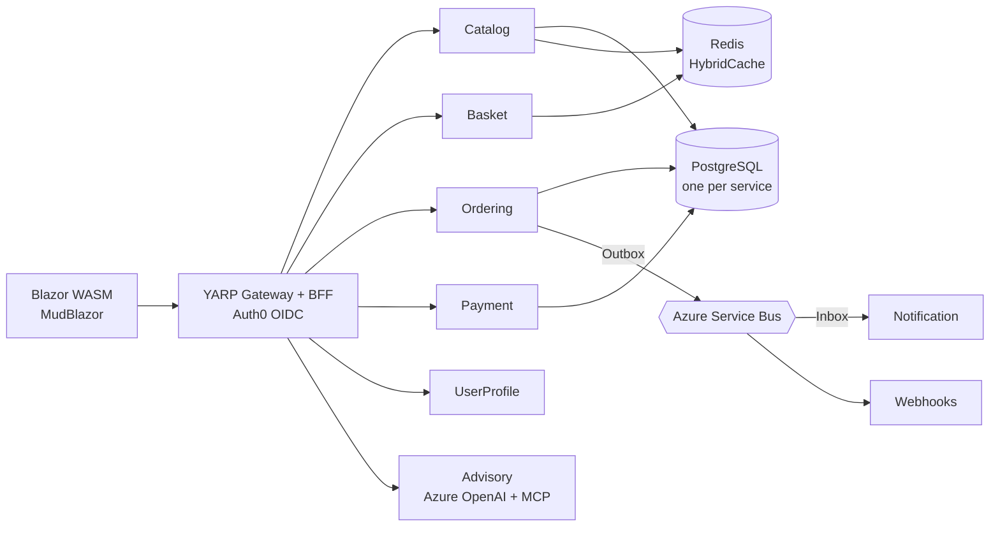

# Moritz Waldau

**IT Consultant @ Cluster Reply — .NET, Azure, and agentic AI.**

I design and modernize .NET systems that people actually depend on, and I spend a lot of my time
these days on where AI agents fit into that work.

## About

After a dual study program in Business Information Systems (B.Sc.), I worked at Swiss Life
Germany on applications used daily by more than 13,000 advisors. Today I own the maintenance and
evolution of a .NET 4.8 legacy application, make the architecture calls, and help the client
prioritize the epics on the way to a modern .NET 9 MAUI solution.

AI-assisted development is a fixed part of that day: I work with Claude Code and GitHub Copilot
daily, build AI agents and my own MCP servers, and follow the agentic space firsthand.

Away from the keyboard you'll find me in the mountains — hiking in summer, skiing in winter.

## Featured — OrderSphere

My reference architecture for modern e-commerce systems: eight microservices on .NET 10, cut
along Clean Architecture and Domain-Driven Design boundaries, with CQRS over MediatR and a
`Result<T>` pattern throughout instead of exceptions. Every service owns its PostgreSQL database
and communicates asynchronously over Azure Service Bus with the Outbox/Inbox pattern.

- 8 microservices · Clean Architecture · DDD · CQRS
- Outbox/Inbox over Azure Service Bus, one PostgreSQL database per service
- AI advisory agent on Azure OpenAI with a custom MCP server
- CI with a 70% coverage gate, CodeQL, Gitleaks and Trivy
- azd/Bicep deployment to Azure Container Apps

**[→ OrderSphere](https://github.com/Moritz1708/OrderSphere)**

## Elsewhere on GitHub

- **[Portfolio](https://github.com/Moritz1708/Portfolio)** — my personal site, [live here](https://moritz1708.github.io/Portfolio/)
- **[EmployeeManagementSystem](https://github.com/MoritzWaldau/EmployeeManagementSystem)** — cloud-native .NET 9 app with Aspire, Docker and GitHub Actions, deployed to Azure Container Apps (on my second account, [@MoritzWaldau](https://github.com/MoritzWaldau))

## Contact

- [LinkedIn](https://www.linkedin.com/in/moritz-waldau-0a5778238/)
- [Portfolio](https://moritz1708.github.io/Portfolio/)
- moritzwaldau99@gmail.com
