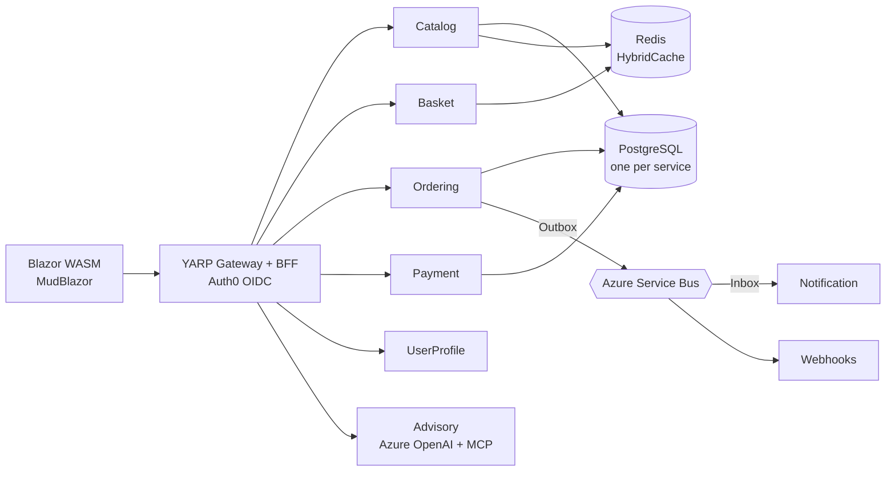

<p align="center">
  
</p>

<p align="center">
  <a href="https://moritz1708.github.io/Portfolio/">
    
  </a>
</p>

<p align="center">
  <a href="https://www.linkedin.com/in/moritz-waldau-0a5778238/"></a>&nbsp;
  <a href="https://moritz1708.github.io/Portfolio/"></a>&nbsp;
  <a href="mailto:moritzwaldau99@gmail.com"></a>
</p>

<br/>

## `about.cs`

```csharp
var moritz = new Engineer
{
    Name      = "Moritz Waldau",
    Role      = "IT Consultant · .NET & Azure",
    Location  = "Hannover, Germany",
    Degree    = "B.Sc. Business Information Systems (dual study program)",

    Focus     = [".NET", "Azure", "Clean Architecture", "AI Agents"],
    Currently = "Owning the architecture of a .NET 4.8 → .NET 9 MAUI modernization",
    Track     = "Applications used daily by 13,000+ financial advisors",

    Daily     = ["Claude Code", "GitHub Copilot", "own MCP servers"],
    OffDuty   = ["Hiking in summer", "Skiing in winter"],
};
```

I design and modernize .NET systems that people depend on every day — and I spend a growing share
of my time on where AI agents fit into that work: building agents, writing MCP servers, and using
agentic tooling as a first-class part of the development loop rather than an add-on.

<br/>

## Tech Stack

<table align="center">
  <tr>
    <th align="center">Backend</th>
    <th align="center">Cloud &amp; DevOps</th>
    <th align="center">Data</th>
    <th align="center">Frontend</th>
  </tr>
  <tr>
    <td align="center" valign="top">
      &nbsp;&nbsp;
      &nbsp;&nbsp;
      &nbsp;&nbsp;
      
    </td>
    <td align="center" valign="top">
      &nbsp;&nbsp;
      &nbsp;&nbsp;
      &nbsp;&nbsp;
      &nbsp;&nbsp;
      
    </td>
    <td align="center" valign="top">
      &nbsp;&nbsp;
      
    </td>
    <td align="center" valign="top">
      &nbsp;&nbsp;
      
    </td>
  </tr>
</table>

<p align="center">
  
  
  
  
  
  
</p>

<p align="center">
  <b>AI &amp; Agentic Development</b><br/><br/>
  
  
  
  
</p>

<br/>

## Featured Project

<table>
  <tr>
    <td width="50%" valign="top">
      <h3 align="center"><a href="https://github.com/Moritz1708/OrderSphere">OrderSphere</a></h3>
      <p align="center">
        
        
        
      </p>
      <p>
        A reference architecture for modern e-commerce systems: <b>eight microservices on .NET 10</b>,
        cut along Clean Architecture and DDD boundaries, CQRS over MediatR, and a <code>Result&lt;T&gt;</code>
        pattern throughout instead of exceptions.
      </p>
      <ul>
        <li>Outbox/Inbox over <b>Azure Service Bus</b>, one PostgreSQL database per service</li>
        <li>YARP gateway with <b>BFF</b> and Auth0 OIDC, Redis <b>HybridCache</b></li>
        <li>AI advisory agent on <b>Azure OpenAI</b> with a custom <b>MCP server</b></li>
        <li>CI with a <b>70 % coverage gate</b>, CodeQL, Gitleaks and Trivy</li>
        <li><b>.NET Aspire</b> locally, <b>azd / Bicep</b> to Azure Container Apps</li>
      </ul>
    </td>
    <td width="50%" valign="top">
      <h3 align="center"><a href="https://github.com/Moritz1708/Portfolio">Portfolio</a></h3>
      <p align="center">
        
        
        
      </p>
      <p>
        My personal site — a <b>Blazor WebAssembly PWA on .NET 10</b> with a service worker for offline
        use, built and deployed to GitHub Pages through GitHub Actions.
      </p>
      <p align="center">
        <a href="https://moritz1708.github.io/Portfolio/"></a>
      </p>
      <p><sub>Also on GitHub: <a href="https://github.com/MoritzWaldau/EmployeeManagementSystem">EmployeeManagementSystem</a> — a cloud-native .NET 9 app with Aspire, Docker and GitHub Actions on Azure Container Apps (on my second account <a href="https://github.com/MoritzWaldau">@MoritzWaldau</a>).</sub></p>
    </td>
  </tr>
</table>

### OrderSphere — architecture at a glance



<details>
  <summary><b>How a request flows through it</b> — click to expand</summary>
  <br/>
  <ol>
    <li>The <b>Blazor WASM</b> client never talks to a service directly — every call goes through the <b>YARP gateway</b>, which acts as a BFF and keeps the Auth0 OIDC session in a cookie, so no tokens live in the browser.</li>
    <li>Each service owns its <b>domain</b>, its <b>application layer</b> (CQRS handlers over MediatR) and its <b>own PostgreSQL schema</b>. No shared database, no cross-service joins.</li>
    <li>State changes other services care about are written to an <b>Outbox table in the same transaction</b> as the domain change, then relayed to Azure Service Bus. Consumers dedupe through an <b>Inbox</b>, so delivery is at-least-once but processing is effectively once.</li>
    <li>Hot read paths (catalog, basket) sit behind <b>Redis HybridCache</b> — L1 in-process, L2 distributed, invalidated by the same events.</li>
    <li>The <b>Advisory</b> service exposes the catalog to an Azure OpenAI agent through a custom <b>MCP server</b>, so the agent works against the same bounded context as the rest of the system.</li>
  </ol>
</details>

<br/>

## Activity

<p align="center">
  <picture>
    <source media="(prefers-color-scheme: dark)" srcset="https://streak-stats.demolab.com?user=Moritz1708&theme=github-dark-blue&hide_border=true&background=00000000" />
    
  </picture>
</p>

<p align="center">
  <picture>
    <source media="(prefers-color-scheme: dark)" srcset="https://raw.githubusercontent.com/Moritz1708/Moritz1708/output/github-snake-dark.svg" />
    
  </picture>
</p>

<p align="center">
  
</p>
